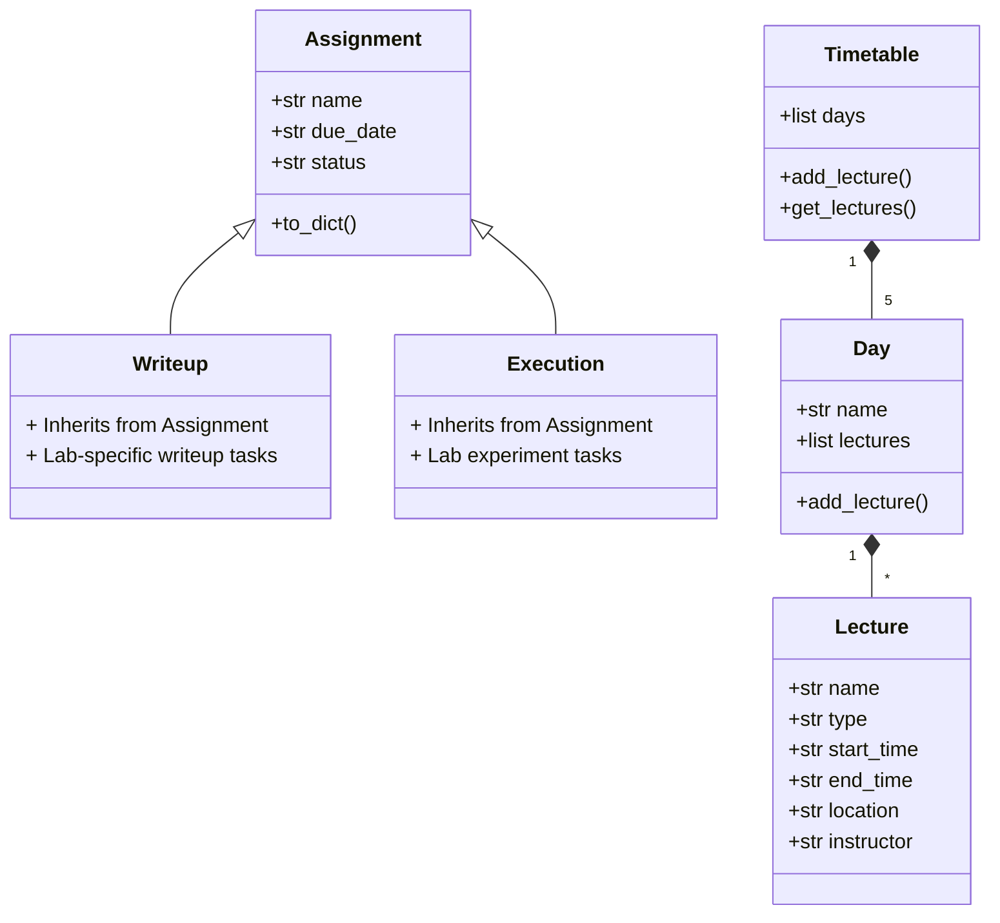

### Timetable and Assignment Manager

This Python script helps students manage their weekly timetable and assignment tracking in one place. You can:

- Schedule lectures (Theory/Lab/Other) with times, locations, and instructors
- Track assignments (regular tasks, lab writeups, and experiment executions)
- Mark assignments as completed
- View daily schedules and pending assignments

## Features

📅 **Timetable Management**
- Schedule lectures across Mon-Fri
- Automatic end-time calculation using duration
- Daily schedule display

📝 **Assignment Tracking**
- Add assignments during lectures
- Lab sessions create both writeup AND execution tasks
- Mark tasks as completed
- Persistent storage in JSON

⚠️ **Proactive Alerts**
- Automatically checks for assignments at runtime
- Shows pending tasks at program exit

## Getting Started

1. **First Run Setup**
```bash
python Timetabler.py
```
- Creates timetable structure when you run for first time
- Fill in your weekly lecture schedule when prompted

2. **Daily Usage**
- Program automatically checks for today's lectures
- Add new assignments if given during class
- Mark completed tasks when you finish them

3. **Data Persistence**
- Lectures saved in `timetable.json`
- Assignments saved in `assignments.json`

## Usage Example
```
Let's set up your weekly timetable!

Monday's Schedule:

Enter lecture name (or 'done' to finish day): Algorithms
Start time (HH:MM): 10:00
Duration in minutes: 90
Location: Building A-201
Instructor: Dr. Smith
Type (Theory/Lab/Other): Theory
Add another lecture? (y/n): n

Tuesday's Schedule: 
...
```

During operation:
```python
Was there an assignment given for Algorithms? (y/n): y
Enter assignment name: Sorting Analysis
Enter due date (YYYY-MM-DD): 2023-11-15

Current Assignments:
1. Sorting Analysis - Due: 2023-11-15 - Status: Not Started

Enter assignment number to mark as completed (or 'done'): 1
Marked 'Sorting Analysis' as completed!
```

## Class Structure


## Installation
No special dependencies required. Just Python 3.x:
```bash
python -m pip install datetime
```

Perfect for students who want to:
- Visualize weekly schedules
- Never miss assignment deadlines
- Maintain progress tracking without complex apps

Note: All data persists between sessions - ideal for semester-long use!
